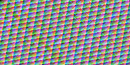

# Rendu Apple AIR sur Radeon et support Tahoe — 7 octobre 2026

**Les 48 cas du corpus Metal/AIR passent sur la RX 9070 XT sous Windows.**
Les 330 984 pixels RGBA sont exactement conformes à la référence CPU : aucun
écart de pixels, canaux, upload ou gardes, et aucune erreur Vulkan/synchronisation.
Les 96 fichiers RGBA de sortie/référence sont identiques octet par octet à ceux
du contrôle GLSL rejoué avec le même banc. Le support USB OpenCore/Tahoe est
également préparé et vérifié ; son premier démarrage physique reste à essayer.

Code testé : `6b134b9a5db915e39b6ffaee9f83469670b8b78e`, checkout propre,
branche `codex/amd-validation-bootstrap`. Les caches Rust/Ninja existants sont
réutilisés ; les changements Mac sont reconstruits. Ce n'est pas une nouvelle
construction depuis une copie propre. Les [preuves JSON](2026-10-07-metal-graphics-radeon.json)
conservent les cas, allocations, versions et empreintes avec chemins portables.
Le [rapport Mac](2026-10-07-metal-graphics.md) documente la production des AIR.

## Résultats

| Vérification | Résultat |
| --- | --- |
| Tests Rust ciblés Windows | 15 réussis ; quatre balayages du corpus absent filtrés |
| CTest Windows du banc modifié | 13 réussis |
| Tests Python | 8 réussis |
| Corpus Apple : empreintes, réflexion et spirv-val | Quatre shaders admis, aucune substitution GLSL |
| Graphiques Metal/AIR | 48 cas ; 330 984 pixels ; erreur maximale 0 |
| Graphiques GLSL, même banc | 48 cas ; mêmes images et références, 96 fichiers identiques |
| Calcul Apple AIR et GLSL | 36 cas chacun ; aucun écart ni erreur Vulkan |
| GPU absent, alpha erroné, R/B inversés | Trois rejets attendus, zéro erreur Vulkan |

Le pilote observé est AMD proprietary driver `26.8.1 (LLPC)`, API Vulkan
`1.4.349`, sur l'identité PCI `1002:7550`. Les outils restent MSVC 19.51,
SDK Windows 10.0.26100.0 et SDK Vulkan 1.4.350.0. `shaderInt8` est requis et
exercé par le fragment texture traduit ; le banc le contrôle et l'active.
Le profil direct `NVMTL_NO_BINDLESS_ALL=1` conserve image 32, sampler 160 et
DrawParams au binding 0. Ce résultat ne corrige pas l'ABI bindless NVIDIA.

Les 48 cas comprennent 15 copies/transferts sans shader, 15 échantillonnages
de texture, neuf triangles et neuf mélanges alpha. Les 33 derniers cas
exécutent les modules SPIR-V graphiques traduits depuis les AIR Apple.
Tous les canaux, couvertures et gardes sont comparés. Les tolérances restent
0 pour les textures et 1/255 pour les scènes colorées ; l'erreur observée vaut 0.

## Support USB préparé

À la demande de l'utilisateur, l'ancien volume D: du disque USB Hitachi
HTS545050A7E de 500 Go a été sauvegardé (149 fichiers, 1 792 524 536 octets,
SHA-256 conformes), puis repartitionné en GPT avec les outils Windows.
Le SSD Windows et ses partitions ne sont pas modifiés par cette préparation.

- **D: OPENCORE**, FAT32, 8 Gio : `EFI/`, `com.apple.recovery.boot/`, instructions.
- **E: TAHOEFILES**, exFAT : paquet complet, notices et `OpenCore-Secours/EFI/` avec `-x`.
- Récupération Apple **Tahoe 26.6.2 / 25G83** : signature RSA et 92 blocs vérifiés.
- Paquet complet **Tahoe 26.7.1 / 25G241**, 18 380 974 544 octets : 1 753 blocs
  SHA-256 vérifiés, table XAR conforme au catalogue Apple. Sa signature de paquet
  reste à contrôler sur Mac avec `pkgutil --check-signature`.
- Les empreintes du paquet, de la récupération et des deux EFI sont relues
  depuis le disque USB. Les deux configurations copiées passent `ocvalidate` 1.0.8.

La récupération amorçable exige Ethernet et Internet pendant l'installation.
Le paquet complet sur E: sert au transfert vers le Mac pour préparer ensuite
un installateur hors ligne avec `createinstallmedia` ; il n'est pas utilisé
comme charge utile hors ligne par cette récupération.

Premier essai : régler l'UEFI selon le [guide](../OPENCORE-TAHOE.md), utiliser
F12 puis l'entrée UEFI du disque USB, et choisir macOS Base System dans OpenCore.
Le profil conserve `-radvesa` et n'inclut aucun kext expérimental Navi48/RDNA4FB.
La version réellement installée, l'affichage de base, le réseau et le secours
doivent être relevés et essayés avant de qualifier le boot.

## Limites et rejeu

Ces résultats valident le corpus choisi sous le pilote AMD **Windows**, en
Vulkan. Ils ne qualifient ni l'API Metal sous macOS, ni RADV Darwin, ni le pilote
noyau Navi48. Le bureau Tahoe et l'affichage sans accélération restent à tester.
La suite Rust complète manque toujours trois fixtures amont ; les dispatchs
dépendants, files multiples et mémoire hôte non cohérente restent ouverts.

Rejouer la [procédure graphique](../VALIDATION-GRAPHICS.md) avec
`-ShaderOrigin metal-air`, puis les contrôles GLSL/calcul et les rejets.
Les rapports locaux de cet essai sont sous `reports/local/*-20261007-1851/` ;
les journaux de préparation USB et de compilation restent dans
`out/usb/tahoe-D-2026-10-07/`, ignorés par Git. Les identités SMBIOS, numéros de
série du disque USB et chemins personnels ne sont pas publiés.
