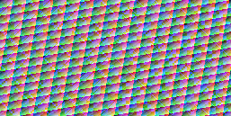

# Rendu hors écran sur Radeon — 7 octobre 2026

**Les 48 cas graphiques passent sur la RX 9070 XT sous Windows.** Les copies de
texture, l'échantillonnage, le triangle et le mélange alpha correspondent
exactement à la référence CPU : **330 984 pixels, soit 1 323 936 canaux RGBA**,
sans écart de pixels, d'upload ou de gardes, et sans erreur Vulkan/synchronisation.
Les 36 cas Apple AIR et les 36 cas du contrôle GLSL passent également après
l'ajout du rendu ; leurs résultats sont identiques.

Identifiant : `step-2-radeon-windows-offscreen-1`.
Code testé : `0b2c9f5fa589e09b4698cf037f22f42dc371ecea`, branche
`codex/amd-validation-bootstrap`, checkout propre. Un nouveau dossier Ninja
a été configuré pour vérifier la construction du corpus, puis le même code
commité a été reconstruit et testé avant cette mise à jour documentaire.
Le [rapport JSON](2026-10-07-offscreen-radeon.json) conserve les résultats,
capacités, allocations, versions et empreintes sans chemins personnels.

## Matériel et contrat

| Champ | Valeur |
| --- | --- |
| PC | Ryzen 5 5600X, 16 Gio, B550M DS3H / BIOS FD |
| Système | Windows 11 Professionnel x64, build 26300 |
| GPU / PCI / sous-système | Radeon RX 9070 XT / `1002:7550` / `1849:5417` |
| Pilote Windows | `32.0.31041.1004` |
| Pilote Vulkan / API | AMD proprietary driver, `26.8.1 (LLPC)` / `1.4.349` |
| File graphique | Famille 0 |
| Images | `R8G8B8A8_UNORM`, optimal tiling, MSAA 1 |
| Précision sous-pixel | 8 bits |
| Images device-local | 63 allocations : type 0, heap 1, flags 1 (`DEVICE_LOCAL`), non mappées |
| Upload / readback | 78 allocations : type 1, heap 0, flags 6 (`HOST_VISIBLE | HOST_COHERENT`) |
| Gardes | 64 octets `0xa7` avant/après chaque buffer hôte |
| Complétion | Une fence par cas, délai maximal 5 s |
| Origine des shaders graphiques | Contrôles GLSL, SPIR-V Vulkan 1.2 validé |

Le GPU/pilote, les capacités et les allocations ont été relevés pendant cet
essai. Les autres champs matériels reprennent l'inventaire du
[rapport Apple AIR/Radeon](2026-10-07-apple-air-radeon.json), collecté le même
jour à 14:40 UTC ; les champs fabricant/VBIOS, révision de carte mère et premier
écran/connecteur restent à compléter.

Outils : MSVC 19.51, SDK Windows 10.0.26100.0, CMake 4.3.1-msvc1, Ninja,
SDK Vulkan 1.4.350.0, glslang 16.2.0 et SPIRV-Tools v2026.2.

## Résultats et images

| Scène | Cas | Pixels comparés | Tolérance par canal | Erreur maximale constatée |
| --- | --- | --- | --- | --- |
| Copie texture | 15 | 119 010 | 0 | 0 |
| Texture échantillonnée nearest | 15 | 119 010 | 0 | 0 |
| Triangle plein | 9 | 46 482 | 1 sur 255 | 0 |
| Deux triangles / mélange alpha | 9 | 46 482 | 1 sur 255 | 0 |

Les textures couvrent 1×1, 3×5, 64×64, 65×37 et 257×129 ; les triangles
couvrent 32×32, 65×37 et 127×95. Trois répétitions par taille utilisent des
couleurs, motifs et alphas différents. La comparaison porte sur tous les
pixels et les quatre canaux. Les fonds non opaques et les régions superposées
vérifient aussi l'alpha. La tolérance et la géométrie sans échantillon d'arête
ambigu sont détaillées dans la [procédure graphique](../VALIDATION-GRAPHICS.md).

Images relues du GPU, avec leurs références CPU conservées en PNG sans perte :

| Scène / exemple | GPU | Référence CPU |
| --- | --- | --- |
| Texture, 257×129, répétition 2 |  |  |
| Triangle, 127×95, répétition 2 |  |  |
| Mélange alpha, 127×95, répétition 1 |  |  |

Les **48 paires d'images RGBA** ont les mêmes octets et les mêmes SHA-256.
Les PNG publiés ont aussi été décodés pour vérifier qu'ils préservent les
octets RGBA d'origine, puis inspectés visuellement. Le JSON conserve les
empreintes des 96 fichiers bruts et des six PNG publiés.

## Rejets et régression

| Essai | Résultat constaté |
| --- | --- |
| CTest logiciel | 7 réussis, 0 échec |
| ID PCI absent `0x1234` | Code 1, aucune cible sélectionnée, aucun cas graphique soumis |
| Texture dont l'alpha est forcé à zéro | Code 1, premier cas échantillonné rejeté : 1 pixel / 1 canal incorrect, erreur 255 |
| Triangle dont R/B sont inversés | Code 1, premier triangle rejeté : 136 pixels / 272 canaux incorrects, erreur maximale 63 |
| Validation des shaders volontairement faux | `spirv-val` réussi, zéro erreur Vulkan ; échec fondé sur les pixels |
| Corpus Apple transféré | 8 empreintes SHA-256 conformes |
| Calcul Apple AIR, hôte + staging/VRAM | 36 cas réussis, zéro écart et zéro erreur Vulkan/synchronisation |
| Contrôle GLSL de calcul | 36 cas réussis, sorties identiques à Apple/CPU |

Les contrôles négatifs utilisent des copies de shaders dans le dossier de
rapport ; le binaire du banc reste identique. Les tests CPU vérifient aussi
la couverture connue, le blending avec alpha non opaque, le seuil de tolérance
et la détection de corruptions de données et de gardes.

SHA-256 de l'exécutable testé :
`f6b4610484e043d63889638981e76651a67b59e475ba3eb30db6d657c2a71798`.
Les empreintes des quatre SPIR-V, de leurs sources et des shaders négatifs
sont dans le [JSON](2026-10-07-offscreen-radeon.json). Les empreintes des textes
sont celles des octets du checkout Windows ; la conversion LF/CRLF peut les
distinguer d'un checkout Mac.

## Reproduction et portée

```powershell
. ./tools/initialize-windows-dev.ps1
./tools/run-windows-graphics-probe.ps1 -DeviceId 0x7550
./tools/test-windows-graphics-rejections.ps1 -DeviceId 0x7550
./tools/run-windows-probe.ps1 -DeviceId 0x7550 `
  -Shader tests/shaders/apple/vector_add.spv `
  -Reflection tests/shaders/apple/vector_add.reflection.json `
  -ShaderOrigin metal-air
./tools/run-windows-probe.ps1 -DeviceId 0x7550
```

Preuves locales ignorées par Git :

- `reports/local/2026-10-07-offscreen-radeon/` : rapports, journal, 96 fichiers
  RGBA et leurs 96 PNG sans perte.
- `reports/local/2026-10-07-offscreen-rejections/` : trois scénarios, shaders
  altérés, résultats, diagnostics et synthèse des rejets.
- `reports/local/2026-10-07-offscreen-apple-regression/` et
  `reports/local/2026-10-07-offscreen-glsl-regression/` : calculs et provenances.

Ce résultat qualifie le **rendu de contrôle GLSL sous le pilote Windows** et
préserve le calcul Apple AIR déjà validé. Il reste à produire sur le Mac les
équivalents Metal de ces scènes, les compiler en AIR, les traduire et adapter
le banc à leur réflexion avant de qualifier la traduction graphique du fork.
La compilation du kext/RADV, les essais GPU natifs sous Tahoe, l'exécution via
la couche Metal et le bureau accéléré restent ouverts. Aucun essai de panne
GPU, de présentation ou de stabilité prolongée n'est déduit de ces 48 cas.
